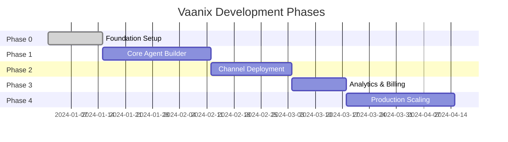

# 🗺️ Vaanix — Voice Agent SaaS Platform Task Plan

> India-first Multilingual Voice Agent Platform for SMBs

---

## 📊 Project Phases Overview



---

## 🏗️ Phase 0: Foundation Setup (Week 1-2) ✅

### Goals
- Establish project structure (modular monolith)
- Configure core infrastructure
- Set up development environment
- Implement multi-tenant foundation

### Engineering Tasks

#### 0.1 Project Initialization
- [x] Initialize Turborepo monorepo with pnpm workspaces
- [x] Initialize Next.js 15 app with TypeScript
- [x] Configure Tailwind CSS v4
- [x] Set up ESLint, Prettier across monorepo
- [x] Configure path aliases and folder structure
- [x] Set up environment variable management (.env.example)

#### 0.2 Backend Foundation
- [x] Initialize Express.js with TypeScript
- [x] Configure project structure (controllers/services/repositories)
- [x] Set up error handling middleware
- [x] Configure CORS, rate limiting, security headers (Helmet)
- [x] Set up logging (Pino with pretty-print)

#### 0.3 Database Setup
- [x] Set up Drizzle ORM in packages/database
- [x] Design and implement multi-tenant schema (organizations, users, agents)
- [x] Configure Neon serverless driver
- [ ] Create Neon PostgreSQL project _(requires user to sign up)_
- [ ] Run initial migration _(requires DATABASE_URL)_
- [ ] Implement connection pooling _(auto with Neon serverless)_

#### 0.4 Authentication
- [x] Integrate Clerk authentication (ClerkProvider, conditional for build)
- [x] Set up Clerk middleware for route protection
- [x] Set up organization-based multi-tenancy context (OrganizationSwitcher)
- [x] Implement role-based access control (RBAC) types and middleware
- [x] Set up protected routes (frontend middleware + backend auth)
- [ ] Configure Clerk project _(requires user to create Clerk app)_
- [ ] Test auth flow end-to-end _(requires Clerk credentials)_

#### 0.5 Infrastructure
- [x] Health check endpoint on backend (/api/health)
- [x] Basic turbo.json pipeline configuration (dev, build, lint)
- [x] Dev scripts working (turbo dev runs both apps)
- [ ] Set up Redis instance (Upstash/local) _(deferred to Phase 1)_
- [ ] Configure BullMQ for job processing _(deferred to Phase 1)_
- [ ] Set up basic CI/CD pipeline _(deferred)_

### Checklist
- [x] Monorepo structure established (Turborepo + pnpm)
- [x] All environment configs documented (.env.example)
- [x] Full build passes (pnpm build — 5/5 packages)
- [x] RBAC types and middleware implemented
- [x] Agent CRUD module with org-scoped queries
- [ ] Auth flow tested end-to-end _(needs Clerk credentials)_
- [ ] Database migrations working _(needs DATABASE_URL)_
- [x] Basic health check endpoint live

### Dependencies
- None (foundation phase)

### Risks
- Clerk + custom org structure complexity
- Neon cold starts affecting DX

---

## 🤖 Phase 1: Core Agent Builder (Week 3-6)

### Goals
- Deliver functional no-code agent builder
- Enable knowledge ingestion
- Provide browser-based voice testing
- Basic agent configuration persistence

### Engineering Tasks

#### 1.1 Agent Data Model
- [x] Design Agent entity schema (extended with systemPrompt, language, voiceId, modelProvider, etc.)
- [x] Implement agent CRUD operations (enhanced with pagination, search, filter)
- [x] Add agent versioning support (version field + publish/archive lifecycle)
- [x] Create agent templates system (agentTemplates table)
- [x] Add knowledge base schema (knowledgeBases, knowledgeDocuments, agentKnowledgeBases)

#### 1.1b AI Provider Abstraction Layer (Plug & Play)
- [x] Create `packages/ai-providers` workspace package
- [x] Define unified `LLMProvider` and `EmbeddingProvider` interfaces
- [x] Build registry with .env-based auto-discovery + per-agent overrides
- [x] Implement OpenAI provider (LLM + Embeddings)
- [x] Implement Google Gemini provider (LLM)
- [x] Implement Azure OpenAI provider (LLM + Embeddings)

#### 1.2 Agent Configuration UI ✅
- [x] Install react-hook-form, zod, @hookform/resolvers on `@vaanix/web`
- [x] Build `AgentCard` component (status badges, menu actions, language display)
- [x] Build `CreateAgentDialog` (react-hook-form + zod validation)
- [x] Build agents list page (grid view, search bar, status filter tabs)
- [x] Build agent detail page at `/dashboard/agents/[id]` (General tab with model config)
- [x] Build agent detail layout with tabbed navigation + header
- [x] Build Personality & Prompt tab (system prompt + personality/tone)
- [x] Build Voice & Language tab (language selection + voice ID)
- [x] Build Messages tab (greeting + fallback message)
- [x] Build `useAgents` and `useAgent` custom hooks (CRUD + publish/archive/duplicate)
- [x] Build shared Zod validation schemas (`validations/agent.ts`)

#### 1.3 Visual Builder Canvas (React Flow) ✅
- [x] Integrate React Flow for canvas
- [x] Create custom node types (Start, Prompt, Condition, Action, End)
- [x] Implement edge connection logic
- [x] Build node configuration panels
- [x] Add undo/redo functionality
- [x] Implement canvas save/load
- [x] Create agent workflow serialization format

#### 1.4 Agent Advanced Configuration ✅
- [x] Response style configuration
- [x] Agent templates integration in create dialog

#### 1.4 Knowledge Base System ✅
- [x] Design knowledge entity schema
- [x] Implement file upload service (S3/R2)
- [x] PDF text extraction pipeline
- [x] Website scraping service
- [x] FAQ/Q&A manual entry
- [x] Google Sheets import
- [x] Vector embedding generation (abstract provider)
- [x] Vector storage integration (Pinecone/Qdrant/pgvector abstract connector so that i can use anything without much changes in code.)

#### 1.5 Agent Testing (Browser) ✅
- [x] Integrate Web Speech API for STT
- [x] Connect to TTS provider (Browser SpeechSynthesis; ElevenLabs ready)
- [x] Build chat/voice test interface
- [x] Create LLM orchestration layer
- [x] Implement context injection from knowledge base
- [x] Add conversation history tracking
- [x] Build test session logging

### Checklist
- [x] Agent can be created and configured
- [x] Knowledge can be uploaded and processed
- [x] Agent can be tested via browser voice
- [x] Conversation logs are captured
- [x] Agent state is persisted correctly

### Dependencies
- Phase 0 complete
- Vector DB provider selected
- TTS/STT provider selected

### Risks
- React Flow performance with complex workflows
- Embedding costs at scale
- India-optimized TTS quality

---

## 📡 Phase 2: Channel Deployment (Week 7-9)

### Goals
- Enable web widget deployment
- Prepare telephony integration architecture
- WhatsApp integration (sandbox/basic)

### Engineering Tasks

#### 2.1 Deployment Entity
- [ ] Design Deployment schema (agent → channel mapping)
- [ ] Implement deployment CRUD
- [ ] Add deployment status tracking
- [ ] Create deployment credentials management

#### 2.2 Web Widget
- [ ] Build embeddable widget bundle
- [ ] Create widget configuration API
- [ ] Implement widget theming system
- [ ] Add domain whitelisting
- [ ] Build widget installation guide
- [ ] Create widget preview in dashboard

#### 2.3 Telephony Preparation
- [ ] Abstract telephony provider interface
- [ ] Design call session management
- [ ] Build audio streaming pipeline architecture
- [ ] Implement call webhook handlers
- [ ] Create number provisioning flow (UI)
- [ ] Add call recording storage

#### 2.4 WhatsApp Integration
- [ ] WhatsApp Business API integration
- [ ] Message webhook handling
- [ ] Voice message transcription flow
- [ ] Text response flow
- [ ] Media handling (images, docs)
- [ ] Session/conversation management

### Checklist
- [ ] Web widget can be generated and embedded
- [ ] Widget customization works
- [ ] Telephony architecture documented
- [ ] WhatsApp sandbox flow working
- [ ] All channels connect to unified agent runtime

### Dependencies
- Phase 1 complete
- Telephony provider selected (Twilio/Exotel/Plivo)
- WhatsApp Business API access

### Risks
- WhatsApp Business API approval delays
- Telephony costs in India
- Real-time audio latency

---

## 📊 Phase 3: Analytics & Billing (Week 10-11)

### Goals
- Implement usage tracking
- Build analytics dashboard
- Set up billing infrastructure

### Engineering Tasks

#### 3.1 Usage Tracking
- [ ] Design UsageRecord schema
- [ ] Implement usage event capture
- [ ] Build usage aggregation jobs
- [ ] Create usage API endpoints
- [ ] Add real-time usage webhooks

#### 3.2 Lead Management
- [ ] Design Lead entity schema
- [ ] Build lead extraction from conversations
- [ ] Implement lead list views
- [ ] Create lead export functionality
- [ ] Add lead search and filtering
- [ ] Build lead detail views

#### 3.3 Analytics Dashboard
- [ ] Agent performance metrics
- [ ] Conversation volume charts
- [ ] Lead conversion tracking
- [ ] Channel comparison views
- [ ] Time-based filtering
- [ ] Export reports

#### 3.4 Billing System
- [ ] Integrate Stripe/Razorpay
- [ ] Design pricing plans
- [ ] Implement subscription management
- [ ] Build usage-based billing calculation
- [ ] Create billing dashboard
- [ ] Add payment history
- [ ] Implement invoice generation

### Checklist
- [ ] Usage is tracked accurately
- [ ] Analytics dashboard is functional
- [ ] Billing flow works end-to-end
- [ ] Leads are captured from all channels
- [ ] Export/integration works

### Dependencies
- Phase 2 complete
- Payment provider selected

### Risks
- Usage metering accuracy
- Billing edge cases

---

## 🚀 Phase 4: Production Scaling (Week 12-15)

### Goals
- Production-ready telephony
- WhatsApp production deployment
- Performance optimization
- Monitoring and observability

### Engineering Tasks

#### 4.1 Telephony Production
- [ ] Production number provisioning
- [ ] Call routing optimization
- [ ] Failover handling
- [ ] Call quality monitoring
- [ ] Outbound calling support
- [ ] IVR flow integration

#### 4.2 WhatsApp Production
- [ ] Production API migration
- [ ] Message template management
- [ ] Opt-in/opt-out handling
- [ ] Rate limit management
- [ ] Multi-number support

#### 4.3 Performance
- [ ] Database query optimization
- [ ] Redis caching strategy
- [ ] CDN setup for static assets
- [ ] API response optimization
- [ ] Frontend bundle optimization

#### 4.4 Observability
- [ ] APM integration (Sentry/Datadog)
- [ ] Log aggregation
- [ ] Alerting system
- [ ] Dashboard for system health
- [ ] Incident response playbooks

#### 4.5 Security Hardening
- [ ] Security audit
- [ ] Penetration testing
- [ ] Data encryption review
- [ ] Compliance checklist (DPDP)

### Checklist
- [ ] Telephony works in production
- [ ] WhatsApp production approved
- [ ] System handles target load
- [ ] Monitoring in place
- [ ] Security review complete

### Dependencies
- Phase 3 complete
- Production accounts with providers

### Risks
- Production approval delays
- Scale testing infrastructure costs

---

## 🔗 Dependency Graph

```
Phase 0 (Foundation) ✅
    │
    ├── Auth + Multi-tenancy
    ├── Database Schema
    └── Infrastructure
          │
          ▼
Phase 1 (Agent Builder) ✅
    │
    ├── Visual Builder
    ├── Knowledge System
    └── Voice Testing
          │
          ▼
Phase 2 (Channels)
    │
    ├── Web Widget
    ├── Telephony Prep
    └── WhatsApp
          │
          ▼
Phase 3 (Analytics + Billing)
    │
    ├── Usage Tracking
    ├── Lead Management
    └── Payments
          │
          ▼
Phase 4 (Production)
    │
    ├── Scale Telephony
    ├── Scale WhatsApp
    └── Observability
```

---

## ⚠️ Critical Path Items

1. **Clerk Integration** — Blocks all authenticated features
2. **Vector DB Setup** — Blocks knowledge-based agent responses
3. **TTS/STT Provider** — Blocks voice testing
4. **React Flow Integration** — Blocks agent builder UX
5. **Telephony Provider** — Blocks phone channel

---

## 📅 Timeline Summary

| Phase | Duration | Milestone | Status |
|-------|----------|-----------|--------|
| Phase 0 | 2 weeks | Foundation live, auth working | ✅ Complete |
| Phase 1 | 4 weeks | Agent builder functional | ✅ Complete (1.1 + 1.1b + 1.2 + 1.3 + 1.4 + 1.5 ✅) |
| Phase 2 | 3 weeks | Web widget deployed | ⬜ Pending |
| Phase 3 | 2 weeks | Billing live | ⬜ Pending |
| Phase 4 | 4 weeks | Production ready | ⬜ Pending |

**Total MVP Timeline: ~15 weeks**

---

## 🎯 Go/No-Go Criteria for MVP Launch

- [ ] 10 agents can be created without errors
- [ ] Knowledge search returns relevant context
- [ ] Web widget loads in <2 seconds
- [ ] Voice test latency <1.5 seconds
- [ ] Lead capture works across all channels
- [ ] Billing processes test payments
- [ ] 99% uptime over 1 week testing
